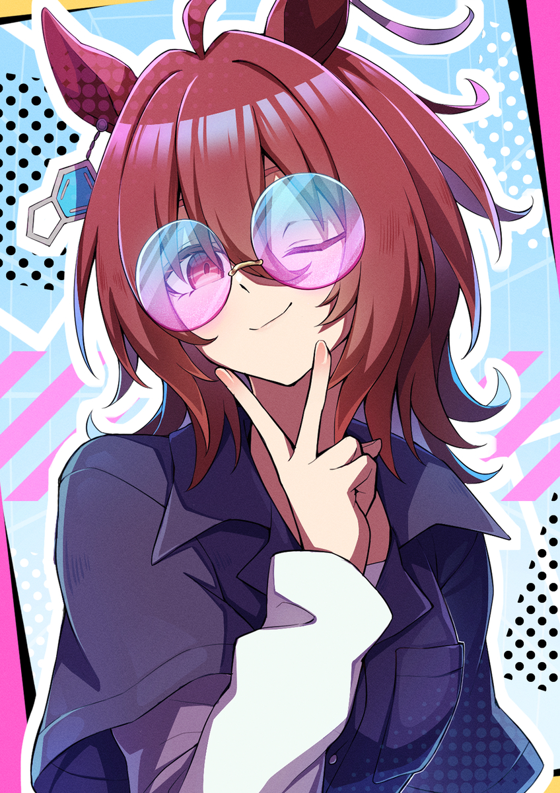
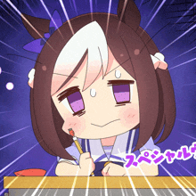

  
<pre>
    💻 BSIT @ STI College • Full-Stack Dev • Web Developer
    🎓 Expected July 2026
    📖 Software architecture • Distributed systems
    🎮 Music • Rhythm Games • Anime • Code
</pre>
 

  
    

SIDE NOTE: I am also improving my portfolio, if you currently access my page, it'll only be an introduction.

<!---
toaster-project/toaster-project is a ✨ special ✨ repository because its `README.md` (this file) appears on your GitHub profile.
You can click the Preview link to take a look at your changes.
--->
